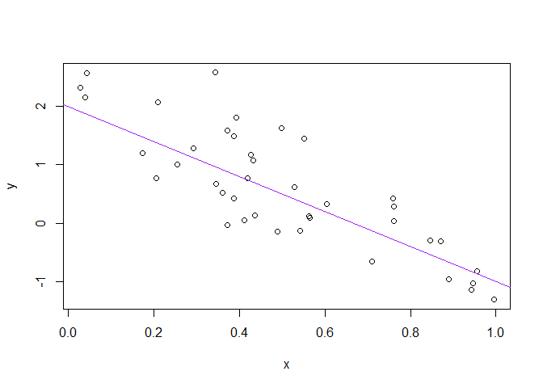

First RMarkdown Hello World!
================
Flamich
2025-01-24

Hello World!

``` r
a <- 2
b <- -3
sig_sq <- 0.5
x <- runif(40)
y <- a + b * x + rnorm(40, sd = sqrt(sig_sq))
(x_n <- mean(x))
```

    ## [1] 0.5030835

``` r
## [1] 0.503
write(x_n, "mittelwert_x.txt")
plot(x, y)
abline(a, b, col = "purple")
```

<!-- -->
